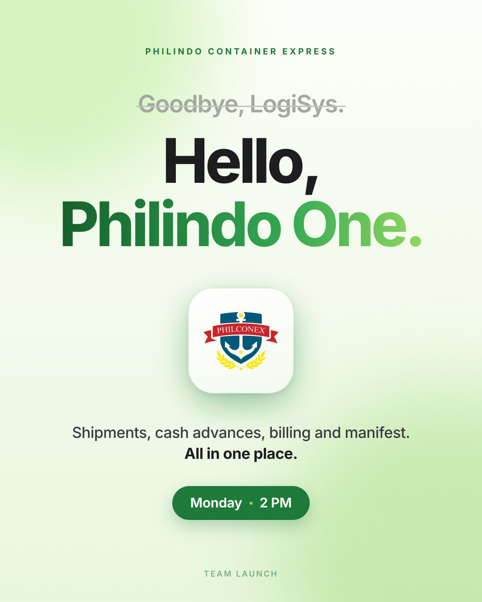
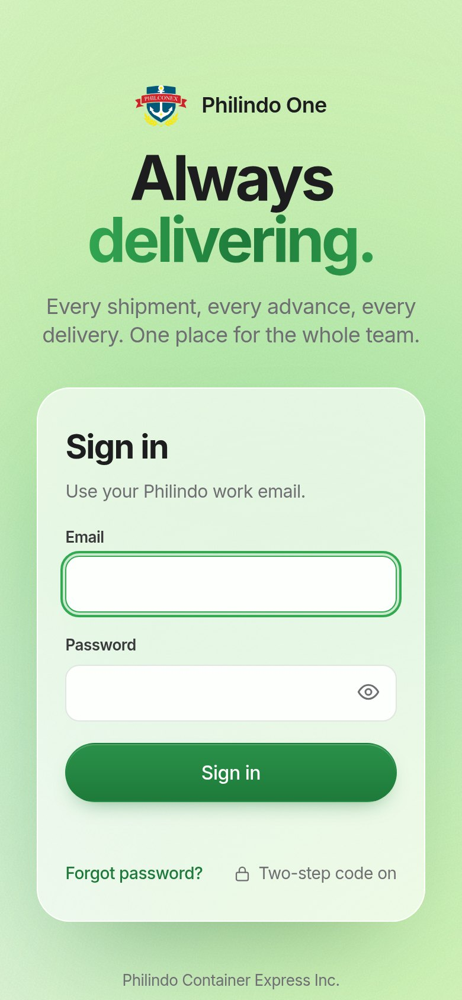
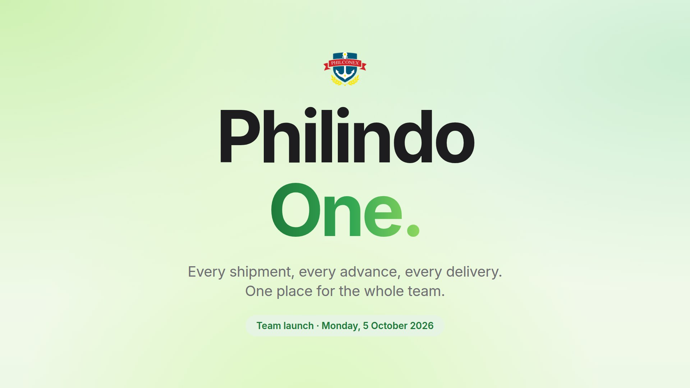
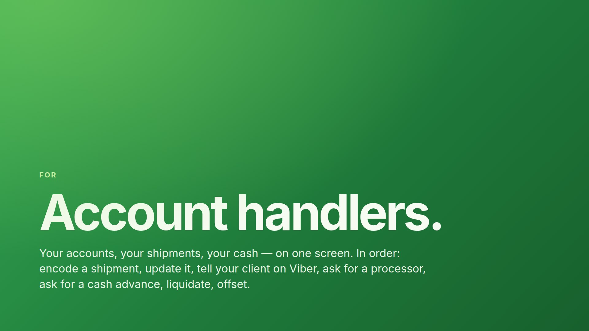
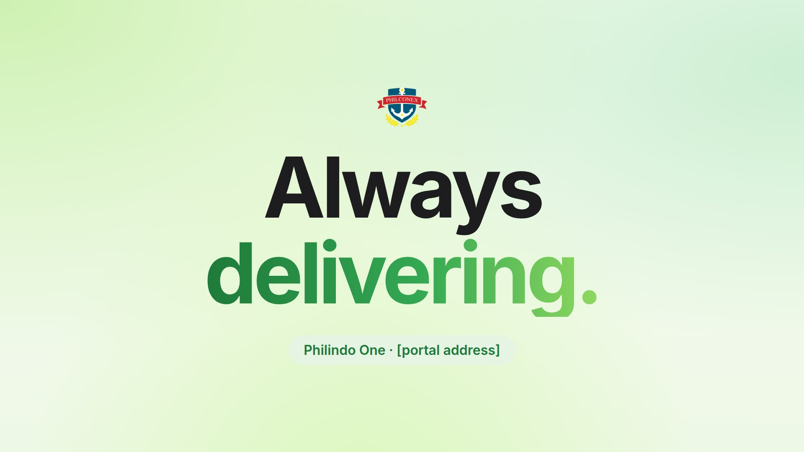

# Philindo design guide

*The look of Philindo One (the system, the team slides and the launch poster), written down so Philindo Logistics can
carry it to social media. 2 October 2026.*

The look started from the new Philindo website and Oliver's screen designs. It was then used for the Philindo One
system, the team launch slides and the "Goodbye, LogiSys. Hello, Philindo One." poster. Everything below is taken from
those, with the exact values, so a designer, Canva or an AI design tool can match it.

| The poster (1080 × 1350) | The system, sign-in on a phone |
|---|---|
|  |  |

| Slide: cover | Slide: section break | Slide: closing |
|---|---|---|
|  |  |  |

More: [the sign-in page on a computer](design/system-sign-in.jpg), [the logo file](design/philconex-logo.png).

---

## 1. The feel, in one minute

- **Bright, calm and roomy.** Lots of light background and empty space. One idea per post.
- **One green, used with care.** Most of the design is soft light green and white. The strong green is for the one
  thing that matters: the payoff word, the button, the date.
- **A big, bold, tight headline.** Everything else is small and quiet.
- **Soft depth.** White cards and tiles float on a soft green glow, with shadows tinted green (never grey or black).
- **Plain words.** Short sentences that end with a full stop. No emojis, no exclamation marks.

If it looks like an Apple product page that happens to be green, it is right.

---

## 2. Colours

### Greens

| Name | Hex | Use it for |
|---|---|---|
| **Deep green** | `#1E7A3A` | The main brand green: buttons and pills, the small capitals line above a headline, any small green text, icons |
| **Green** | `#34A853` | The middle of the gradient; big green words; glows under tiles |
| **Fresh green** | `#8FD85F` | The light end of the gradient; small dots. **Never on its own for text on a light background** (too faint) |
| **Darkest green** | `#17602D` | The dark end of green backgrounds; the start of the poster's gradient |
| **Pale green** | `#E6F4E4` | Soft pills, icon tiles, highlighted rows |
| **Mint** | `#CFF5B0` | Small capitals text on a deep-green background |
| **Cream white** | `#F7FCF2` | Text on deep green; the top of the light background |

### Neutrals

| Name | Hex | Use it for |
|---|---|---|
| **Ink** | `#1D1D1F` | Headlines and main text (a soft black, never pure `#000`) |
| **Ink 2** | `#3A3A3C` | Body text |
| **Muted** | `#6E6E73` | Subtitles, captions |
| **Faint** | `#8E8E93` | Very minor notes |
| **Struck-out grey** | `#A3A8A0` (line `#BEC3BA`) | The "Goodbye, LogiSys." line: the old thing, crossed out |
| **Lines** | `#E3E6E0` | Dividers |
| **Card edge** | `#E8EEE4` | The 1 px edge of white cards |
| **Canvas** | `#F5F7F3` | Plain light background |
| **White** | `#FFFFFF` | Cards, tiles |

### Light for the glow (only ever as soft, blurred light, never as flat colour)

`#B7EB8F` (spring green), `#7FD69A` (mint), `#D4F7AE` (lime), and a very faint warm peach `#FFDEA8` low on the right.

### Status colours (charts and information only, never decoration)

Amber `#8A5A00` on `#FBF1DC`, red `#A3261B` on `#FBE7E4`, blue `#1D5FA8` on `#E8F0FA`.

### How much of each

About **70 % light background, 20 % ink text and white cards, 10 % or less strong green.** On a deep-green post it
flips: green background, cream text, and one light-green accent.

**Readability:** small text (under about 24 px on a 1080 px post) only in ink, ink 2, muted or deep green. `#34A853`
only for big bold words. `#8FD85F` only inside the gradient or as a dot.

---

## 3. The green gradient (the signature)

- **On headlines**, left to right: `#1E7A3A 0% → #34A853 55% → #8FD85F 100%` (slides).
  The poster uses a slightly deeper start: `#17602D 0% → #1E7A3A 22% → #34A853 62% → #8FD85F 100%`.
- **Only on the last word or line of the headline.** The set-up is in ink and the payoff is in green: "Hello, /
  **Philindo One.**" · "Always / **delivering.**" · "Philindo / **One.**" Use one gradient per design, never on
  body text.
- **Leave room under it.** Gradient text can get its bottom cut off in some tools, which clips the tails of g, y, p and
  q. Add a little space under that line (about 8 % of the text size). Always check the "g" in "delivering."
- **In video**, the gradient can slowly shine across the word (one sweep every 8 seconds), as on the sign-in page.
- **For green backgrounds**, a diagonal gradient (135°): `#34A853 0% → #1E7A3A 55% → #17602D 100%`, with a soft light
  spot of `#8FD85F` at 45 % in the top-left corner.

---

## 4. Backgrounds

**A. The soft green glow (the default).**
- Base: top to bottom `#F7FCF2 → #EEF8E6`. The poster is a touch lighter: `#FBFEF8 → #F2FAEB → #E9F6DF`.
- Then large, very blurred circles of light: spring green `#B7EB8F` at 55 % in the top-left corner, mint `#7FD69A`
  at 30–35 % top-right, lime `#D4F7AE` at 60–75 % along the bottom. Optionally add a faint peach `#FFDEA8` at 30 %
  bottom-right for warmth.
- Blur them a lot (about 90 px on a 1080 px post) so there are no visible edges.
- Optional: a very fine grain over everything at 4–6 % (like film). It stops colour banding when Facebook or
  Instagram compress the image.

**B. Deep green**, for statements, quotes and section breaks (see the section slide above).

**C. Plain white or canvas `#F5F7F3`**, for photos, tables and documents.

**Never:** dark or black backgrounds, busy textures, stock gradients in other colours (blue, purple, orange), or
heavy photo filters.

---

## 5. Type

**One font: Inter.** It's free on Google Fonts and built into Canva. The system shows Apple's SF Pro on iPhones and
Macs, which looks almost the same, so Inter matches it everywhere. Don't add a second font.

| Role | 1080 px post | 1920 × 1080 slide | Weight | Spacing | Colour |
|---|---|---|---|---|---|
| Small capitals line above the headline | 19–24 px, ALL CAPS | 24 px | Bold | +3 to +5 px (wide) | Deep green (mint on green) |
| Headline | 120–140 px, at most two short lines | 72 px (cover 200, section 160) | Bold to Extra bold (700–800) | −4.5 % to −5 % (tight), line height 1.0–1.05 | Ink + gradient |
| Subhead | 34–40 px | 32–40 px | Medium (500) | −1.5 %, line height 1.35–1.4 | Ink 2 or muted; key phrase **bold in ink** |
| Card title | 40 px | 40 px | Bold | −2 % | Ink |
| Card text | 26 px | 26–28 px | Regular | normal | Muted |
| Pill / button | 26–30 px | 26–32 px | Semibold | −1 % | Cream on deep green, or deep green on pale green |
| Footer line | 18 px, ALL CAPS | — | Semibold | +3 px | Deep green at 55 % |

Rules:
- Tight letter spacing only on big text; small text stays normal.
- Sentence case. A headline ends with a full stop.
- Capitals only for the small line above the headline and the footer, never for a sentence.
- No italics or underlines. Emphasis is **bold in ink**.

---

## 6. Shapes, depth and spacing

- **Pills, fully rounded.** Two kinds:
  - *Solid:* deep green, cream text, a small fresh-green dot between parts ("Monday • 2 PM"), shadow
    `0 14px 34px rgba(30,122,58,.28)`.
  - *Soft:* pale green `#E6F4E4`, deep green text, no shadow.
- **White cards:** corners 22–28 px, a 1 px edge `#E8EEE4`.
  - Light shadow: `0 10px 40px rgba(30,90,45,.08)`.
  - For a floating screenshot, a deeper double shadow: `0 30px 100px rgba(30,90,45,.22), 0 6px 20px rgba(30,90,45,.10)`.
- **Icon tile:** 84 × 84, corners 22, pale green, with a deep-green line icon about 52 px. Use simple outline icons
  (globe, chart, book, clock, truck, ship), never filled clip-art.
- **Logo tile (the "app icon"):** a white square with rounded corners (236 px with 56 px corners, about 24 %), a
  very light white-to-`#F4FAEF` shade, and a blurred green glow (`#34A853`, 45 %) peeking out underneath.
- **Frosted glass** (the sign-in card): white at 66 %, background blur 18 px, a 1 px white inner edge, corners 28.
- **Screen frame** for screenshots: a white window with a light top bar (`#F3F6F1`) holding three grey dots
  (`#D5DED1`), corners 28.
- **Margins:** at least 7–10 % of the width (80 px on a 1080 post, 128 px on a 1920 slide).
- **Layout:**
  - Stack things with even gaps.
  - Statement posts are centred.
  - Green section-style posts are left-aligned and sit low, with the text at the bottom.
- **Shadows are always green-tinted** (`rgba(30,90,45,…)`), soft and long, never hard or grey.

---

## 7. The logo and the names

- **The crest:** the PHILCONEX shield, with a navy shield, white anchor, red ribbon and yellow laurels. It keeps its own
  colours. These are the only non-green colours in the look, and they live only inside the logo.
- **Never** recolour, stretch, outline or shadow the crest itself, or place it straight on a busy photo.
- **Where it sits best:**
  - on the white logo tile (the poster);
  - straight on the light glow (the slides, 120 px wide on a 1920 slide);
  - on deep green, always on the white tile.
- **Keep clear space** of at least half the logo's width around it.
- **Name lockup:** the logo, then the name in Inter Semibold with tight spacing, as on the sign-in page ("Philindo One").
  For marketing, use the same lockup with **Philindo Logistics**.
- **Footer details:** "Philindo Container Express Inc." and "Manila · Jakarta · Sea · Air · Land" (thin centred dots,
  muted).

---

## 8. Words

- **Voice:** short, plain and confident, the way the system talks to the team. Say what it does, not how great it is.
- **Two-beat headlines:** the set-up in ink, then the payoff in green: "Always / delivering."
- **Lines already in use:**
  - "Always delivering."
  - "Every shipment, every advance, every delivery."
  - "All in one place."
  - "Goodbye, LogiSys. Hello, Philindo One."
  - "Manila · Jakarta · Sea · Air · Land"
- **Ideas in the same voice for client posts** (check any claim with operations first):
  - "Manila to Jakarta. **Always delivering.**"
  - "Sea. Air. Land. **One team.**"
  - "Your shipment. **Tracked to the door.**"
  - "Cleared. Delivered. **On time.**"
- **No** emojis, no exclamation marks, no capitals for whole sentences, and no hashtags inside the image (put them in
  the caption).

---

## 9. Post recipes

1. **Announcement** (portrait, like the poster):
   - small capitals line at the top;
   - optional struck-out grey "old" line;
   - a two-line headline (ink, then gradient);
   - the logo tile or one image;
   - a one-line subhead with the key phrase in bold;
   - a solid pill with the date or call to action;
   - the footer in small capitals.
2. **Statement** (deep green): the diagonal green background, a small mint capitals line, a huge cream headline low on
   the left, one short cream sentence under it. For quotes, milestones and "we're hiring".
3. **What we do** (square or portrait): a headline at the top, then 2–4 white cards in a row or grid. Each card has an
   icon tile, a title and one line. Optionally finish with one deep-green bar at the bottom carrying the key line.
4. **Big number:** the small capitals line ("This month"), one huge number in the gradient (a real figure, checked
   with operations), and one line saying what it is. Nothing else.
5. **Screen or feature** (the client tracking link, for example):
   - a headline at the top;
   - the screenshot in the screen frame, floating on the glow;
   - for a phone, a phone-shaped frame with the same shadow.
6. **Photo post:** a real photo (people, trucks, port, warehouse; bright and natural) in a white card with 28 px corners
   on the glow, with the headline above. Or a full-bleed photo with a white panel at the bottom for the text. Use real
   photos over stock, and no dark or heavily filtered photos.
7. **Story or Reel** (1080 × 1920):
   - the same layout, taller;
   - keep text out of the top 250 px and the bottom 340 px, where the app puts its buttons;
   - centre everything.

---

## 10. Sizes

| Where | Size |
|---|---|
| Instagram and Facebook feed (best) | 1080 × 1350 portrait |
| Instagram and Facebook feed, square | 1080 × 1080 |
| Stories, Reels, TikTok | 1080 × 1920 |
| LinkedIn or Facebook link image | 1200 × 627 |
| LinkedIn post | 1080 × 1350 or 1200 × 1200 |
| YouTube, video, presentations | 1920 × 1080 |

Export designs with text as PNG, and photo-heavy ones as JPG at 85–90 % quality. Design at 2× size if the tool allows,
for crisp text.

---

## 11. Motion (Reels, Stories, video)

- **Background:** the glow drifts very slowly (each light circle moves on a 24–30 second loop).
- **Headline:** the gradient shines across once every 8 seconds.
- **Things arriving:**
  - they rise a little and fade in over 0.6–0.75 s;
  - fast start, soft landing (the curve is `cubic-bezier(0.23, 1, 0.32, 1)`);
  - one after another, 60–100 ms apart.
- **Scene changes:** soft cross-fades. No spins, bounces, zooms or flashy wipes.
- **The signature move:** the shipment journey line from the client tracking page. A flat line fills with a glowing
  green, stage by stage, with the vehicle gliding along. The next point pulses, the front glows, and it's all done in
  under 3 seconds. Use it for "where is my shipment" content.
- Always have a still version that works without motion.

---

## 12. Do and don't

| Do | Don't |
|---|---|
| One idea per post, lots of space | Fill every corner |
| One gradient word, everything else ink | Gradient on several lines, or rainbow colours |
| Inter only, bold and tight for headlines | Script, serif or "fun" fonts |
| Green-tinted soft shadows | Grey, black or hard drop shadows |
| White cards and tiles on the green glow | Dark mode, black backgrounds, neon |
| The crest on white or on the glow | The crest recoloured, outlined or on a busy photo |
| Real photos, bright and natural | Stock photos with fake handshakes, heavy filters |
| Short sentences with full stops | Emojis, exclamation marks, ALL CAPS sentences |

---

## 13. Canva brand kit (copy these in)

- **Colours:**

  ```
  #1E7A3A
  #34A853
  #8FD85F
  #17602D
  #E6F4E4
  #1D1D1F
  #3A3A3C
  #6E6E73
  #F7FCF2
  #EEF8E6
  #FFFFFF
  ```
- **Fonts:** Inter for headings (Bold or Extra bold), subheadings (Medium) and body (Regular).
- **Logo:** `design/philconex-logo.png` (transparent background).
- **Start from:** the poster above. Duplicate it for every announcement and change only the words.
- **Gradient text in Canva:** use a text effect or a gradient fill with the three greens above, left to right. Then
  check the bottoms of g, y and p aren't cut off.

---

## 14. For a designer or an AI design tool

Paste this as the brief:

> Clean, bright, Apple-style design for Philindo Logistics, a Manila and Jakarta freight and customs company. A soft
> light-green background (#F7FCF2 to #EEF8E6) with large, very blurred glows of spring green (#B7EB8F), mint (#7FD69A)
> and lime (#D4F7AE). Typeface: Inter only. A huge, bold, tightly spaced headline in near-black (#1D1D1F), with the last
> word in a left-to-right green gradient (#1E7A3A → #34A853 → #8FD85F). A small bold all-caps line above it in deep
> green (#1E7A3A) with wide letter spacing. A short subhead in grey (#3A3A3C). White rounded cards (24–28 px corners)
> with soft green-tinted shadows. Fully rounded deep-green pill buttons with cream text. Lots of empty space and one idea
> only. No emojis, no dark backgrounds, no stock-photo clichés. The logo is a navy-and-red anchor crest that keeps its
> own colours, shown on a white rounded tile.

---

## 15. For the web designer: the exact tokens

The system's own values (`web/src/app/ops.css` in the Philindo One code):

```css
--ink: #1D1D1F;  --ink2: #3A3A3C;  --muted: #6E6E73;  --faint: #8E8E93;
--line: #E3E6E0; --card-line: #E8ECE5; --canvas: #F5F7F3; --white: #FFFFFF;
--green: #34A853; --deep: #1E7A3A; --deep-hover: #18672F; --pale: #E6F4E4; --ghost-line: #D5DED1;
--grad: linear-gradient(90deg, #1E7A3A 0%, #34A853 45%, #6CC24A 100%);        /* page titles in the system */
--grad-headline: linear-gradient(90deg, #1E7A3A 0%, #34A853 55%, #8FD85F 100%); /* slides */
--shadow: 0 1px 2px rgba(22,60,22,.05), 0 12px 28px -16px rgba(22,80,30,.22), 0 30px 60px -40px rgba(22,80,30,.30);
--shadow-hover: 0 1px 2px rgba(22,60,22,.06), 0 18px 36px -16px rgba(22,80,30,.28), 0 40px 70px -40px rgba(22,80,30,.34);
--shadow-large: 0 40px 80px -32px rgba(20,60,20,.40), 0 2px 8px rgba(20,60,20,.08);
--radius-card: 22px;  --radius-glass: 28px;  --radius-pill: 999px;
--ease: cubic-bezier(0.23, 1, 0.32, 1);
--font: -apple-system, BlinkMacSystemFont, "SF Pro Text", "SF Pro Display", "Inter", "Helvetica Neue", Arial, sans-serif;

/* the glow behind every page */
background:
  radial-gradient(900px 720px at -6% -12%, rgba(183,235,143,.55), transparent 62%),
  radial-gradient(820px 680px at 106% 14%, rgba(127,214,154,.30), transparent 62%),
  radial-gradient(1000px 640px at 42% 118%, rgba(212,247,174,.62), transparent 62%),
  radial-gradient(620px 520px at 92% 98%, rgba(255,222,168,.30), transparent 66%),
  linear-gradient(180deg, #F7FCF2 0%, #EEF8E6 100%);

/* frosted glass */
background: rgba(255,255,255,.66); backdrop-filter: saturate(160%) blur(18px);
box-shadow: inset 0 0 0 1px rgba(255,255,255,.9), 0 40px 80px -40px rgba(20,80,30,.4);

/* body text */
letter-spacing: -.015em; line-height: 1.45; -webkit-font-smoothing: antialiased;
```

Buttons are 44 px tall, fully rounded, deep green with white text, and shrink to 97 % when pressed. Headlines are Bold
with −3.5 % to −5 % letter spacing. Movement uses the `--ease` curve, and anyone who has turned motion off in their
phone's settings sees no animation.
