# Philindo Logistics social media playbook

*How to make posts, carousels and reels in the Philindo One look. You can give this file, together with the
[design guide](philindo-design-guide.md) and the logo, to Claude, ChatGPT, Canva's AI or a designer, then ask for a post.
2 October 2026.*

**A single post**

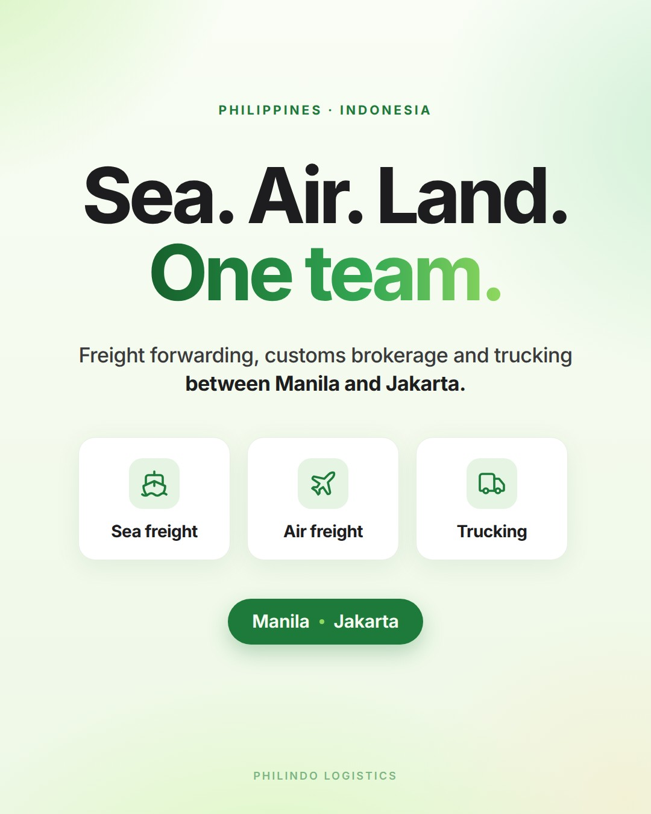

**A carousel** (7 slides, swipe left to right)

| 1 | 2 | 3 | 4 |
|---|---|---|---|
| 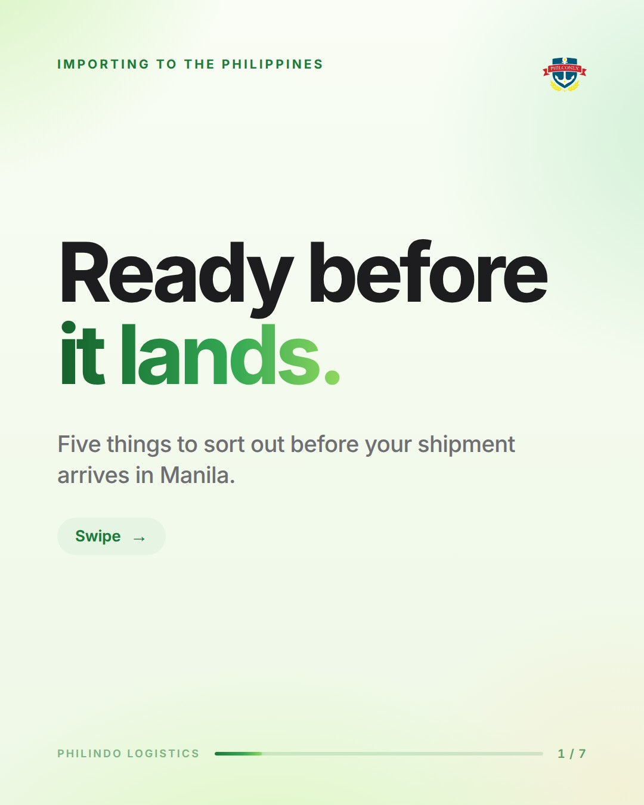 | 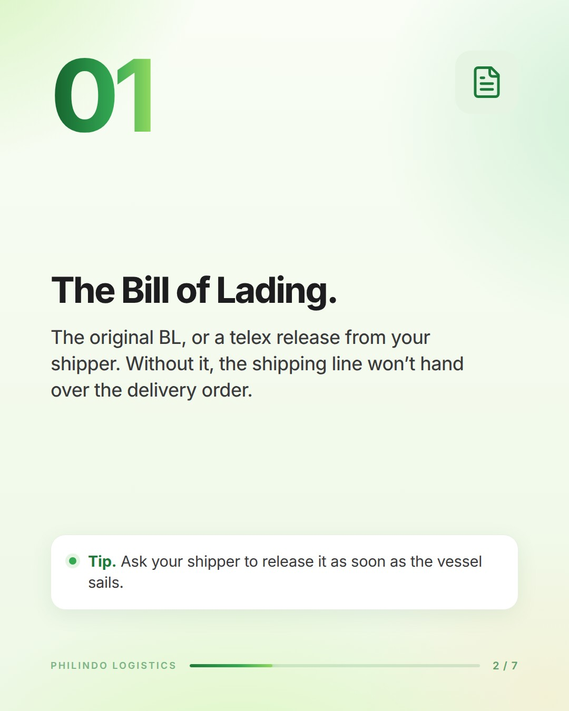 | 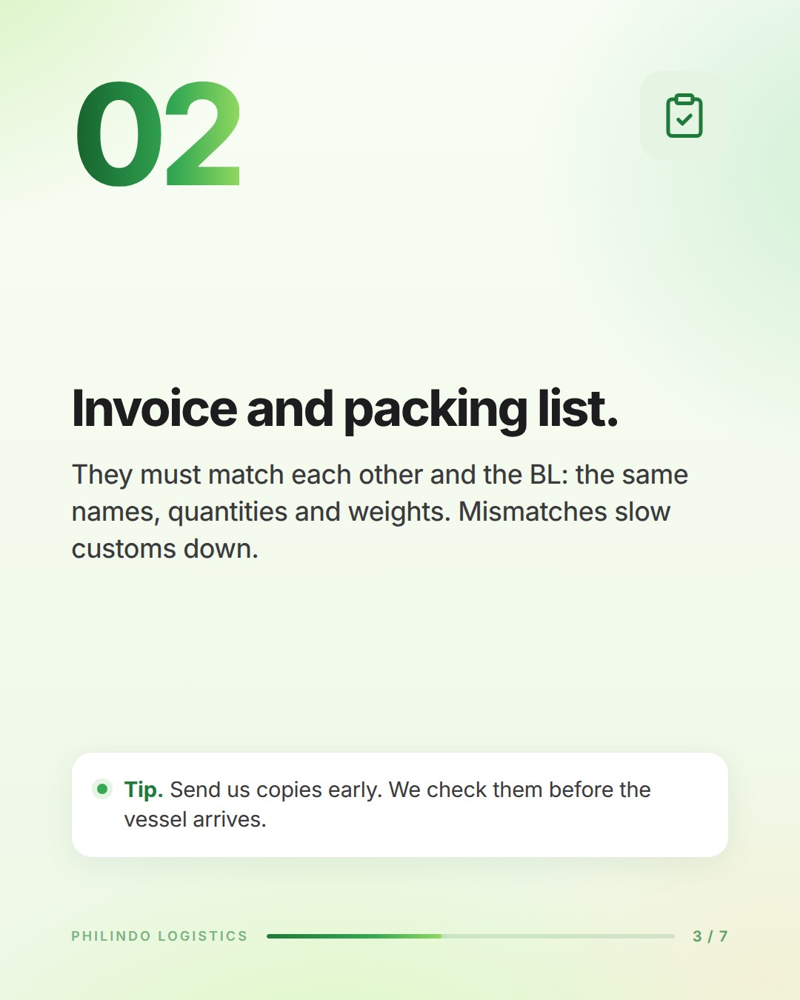 | 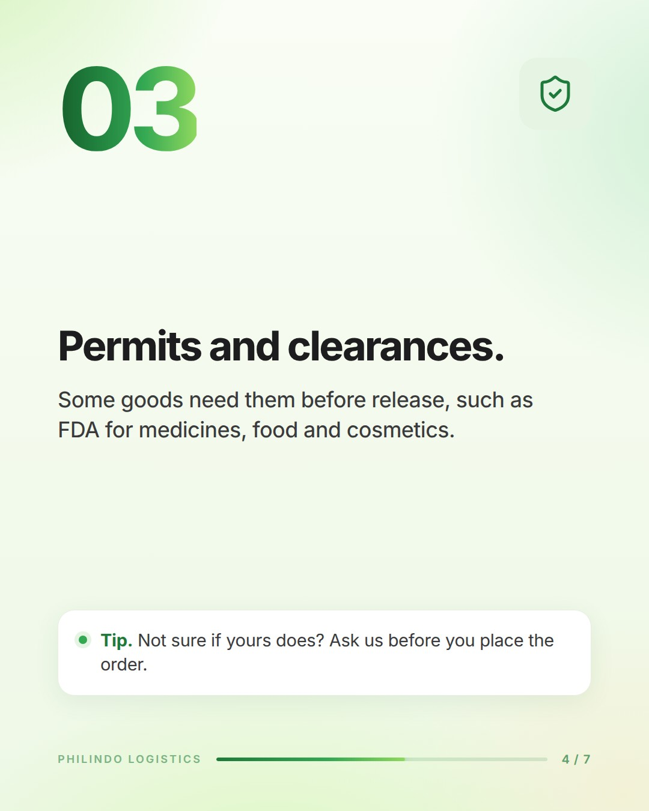 |

| 5 | 6 | 7 |
|---|---|---|
| 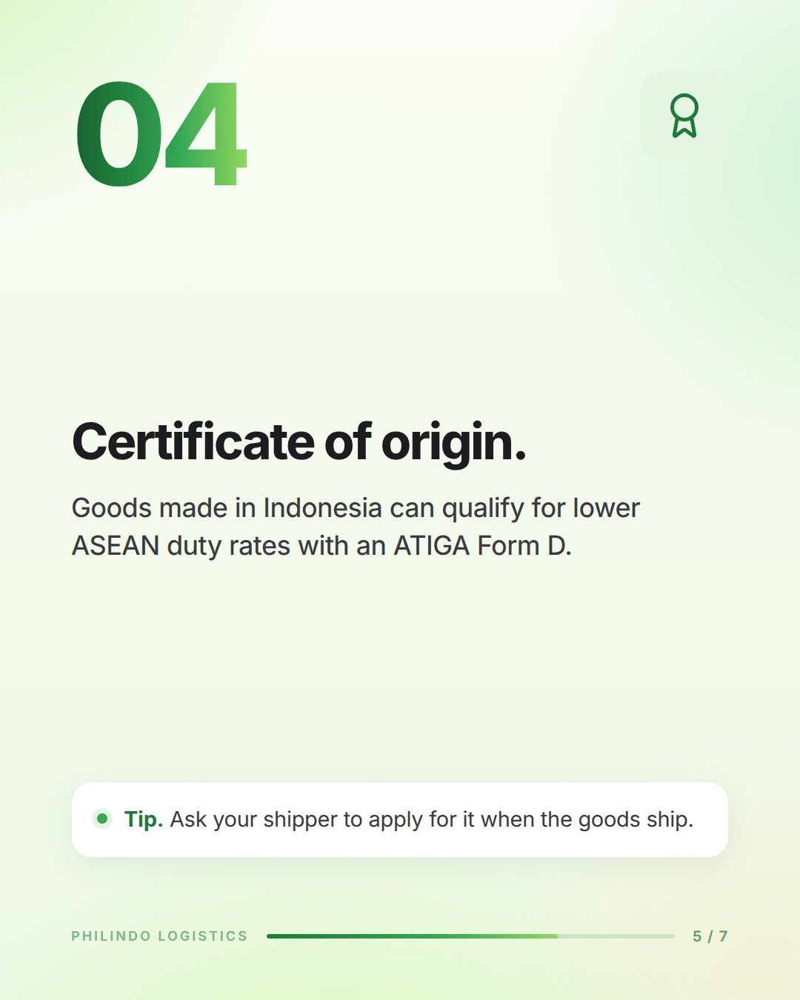 | 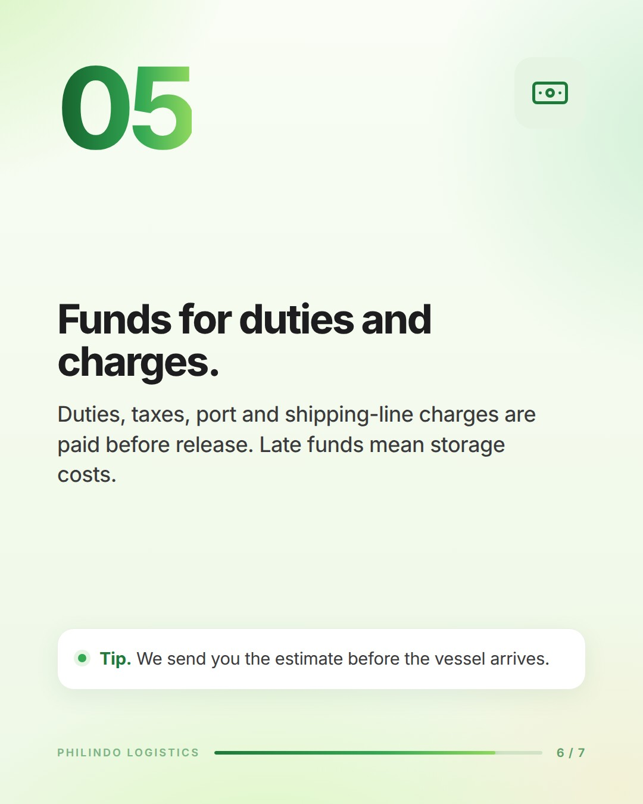 | 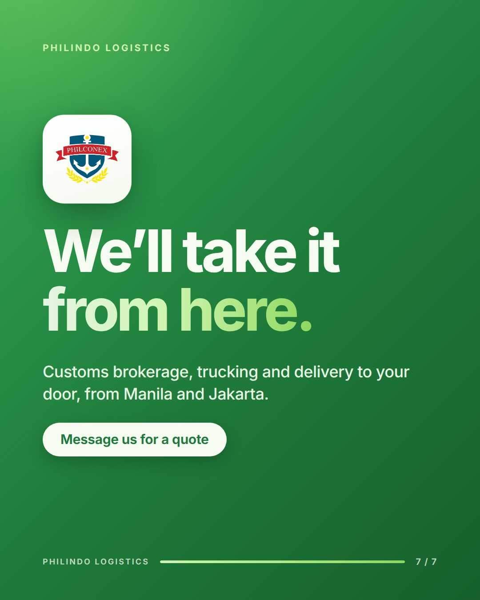 |

**A reel** (four key frames, 20 seconds)

| 0–3 s | 3–9 s | 9–16 s | 16–20 s |
|---|---|---|---|
| 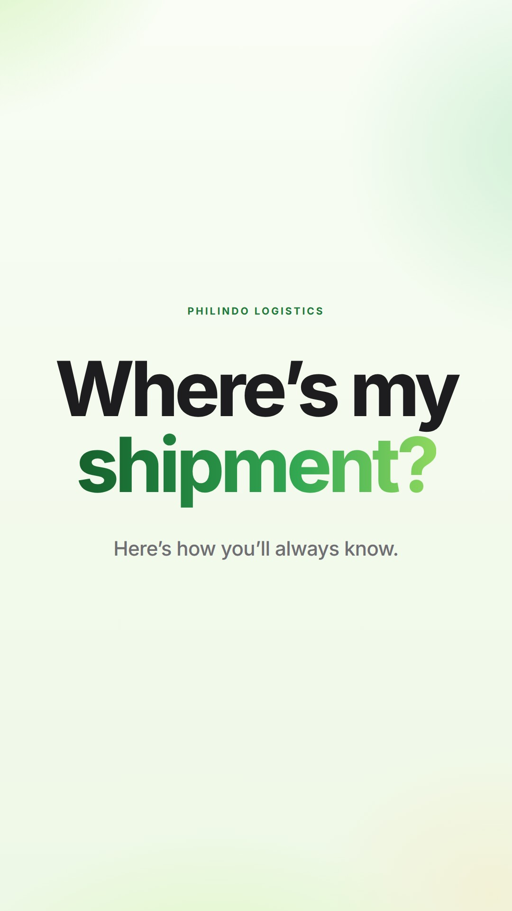 | 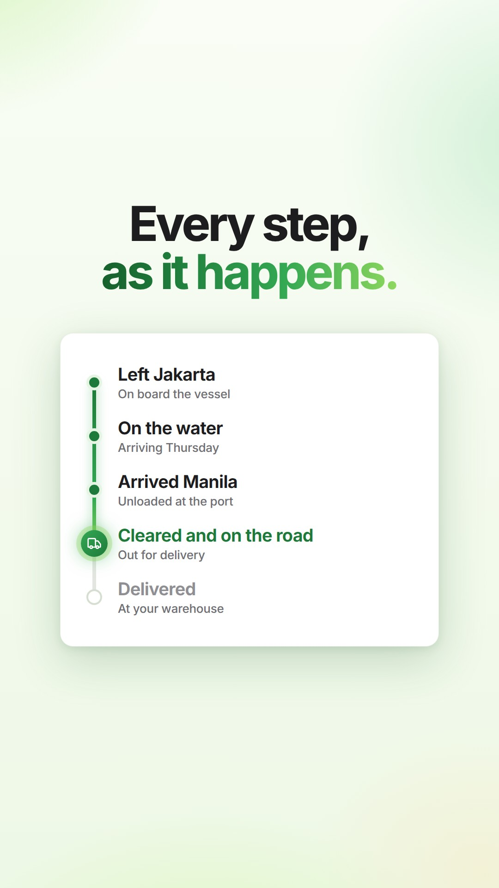 | 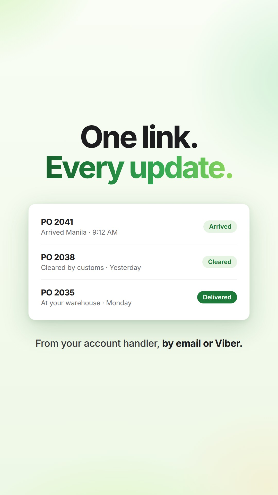 | 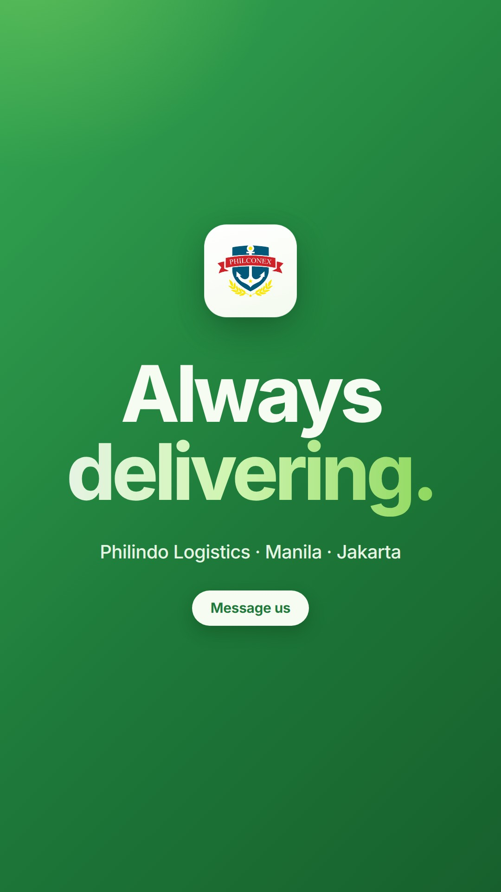 |

These are real designs, ready to post once the facts are checked (section 11). The editable versions are in
`social/template/` (section 12).

---

## How to use this

- **With an AI chat (Claude or ChatGPT).**
  1. Make a project called "Philindo social".
  2. Upload this file, the design guide and `design/philconex-logo.png`.
  3. Paste **the short brief** (section 9) into the project's instructions.
  4. Ask, for example: *"Carousel: what a telex release is, for importers buying from Indonesia."*

  It answers in a fixed format (section 8), ready for whoever builds the design.
- **With Canva.**
  1. Build the six master templates once from the examples above: single post (light), single post (green), carousel
     cover, carousel inside slide, carousel last slide, and reel frame.
  2. Add the colours and Inter to Canva's brand kit (design guide, section 13).
  3. For each new post, duplicate a template and change only the words.
- **With Claude Code** (where Philindo One is built). Ask: *"Make a carousel about X with the social template."* Claude
  edits `social/template/samples.html` and exports the images, sized to post.
- **Always:** go through the checklist in section 10 before anything is posted.

---

## 1. Who we talk to, and why

**People we want to reach**
1. **Importers in the Philippines**: business owners and supply-chain, purchasing and logistics managers in
   medicines, food, consumer goods, retail and manufacturing, especially those buying from Indonesia.
2. **Exporters and shippers in Indonesia** sending goods to the Philippines.
3. **People who could join us:** customs brokers, processors, account handlers, drivers.

**What we want**
- To be known as the Philippines–Indonesia specialists.
- To show we're reliable and easy to work with: updates at every step, documents checked early, delivered to the door.
- More enquiries ("Message us").
- Help with hiring.

**Where**
- **Facebook:** the main channel in the Philippines.
- **LinkedIn:** for decision-makers at importers and exporters.
- **Instagram:** the look and the team.
- **TikTok:** optional, reusing the reels.

---

## 2. What we post about (content pillars)

| Pillar | Share | What it is | Ideas |
|---|---|---|---|
| **Know-how** | 30 % | Short, useful explainers | Before your container lands · What a telex release is · FCL or LCL? · What demurrage is and how to avoid it · Documents for medicines and food |
| **The lane** | 20 % | Philippines ⇄ Indonesia | Manila ⇄ Jakarta at a glance · ASEAN Form D, explained · Holidays that slow shipping in both countries (Lebaran, Christmas: check the dates) |
| **How we work** | 20 % | What it's like to ship with us | Updates by email or Viber · The client tracking link (once live) · Dispatch: processors on the road · Checked numbers (shipments a month, average release time) |
| **People** | 20 % | The team in Manila and Jakarta | Meet a customs broker · A day with our processors · Work anniversaries · We're hiring |
| **News** | 10 % | Announcements | Holiday schedules · Cut-off reminders · New services · Milestones |

---

## 3. A normal week

| Day | Post |
|---|---|
| Monday | **Carousel**, know-how |
| Wednesday | **Single post**, the lane or how we work |
| Friday | **Reel**, people or how we work |
| 2–3 times a week | **Stories**: share the week's post, a poll, a reminder |
| Weekly on LinkedIn | The carousel as a PDF ("document" post), plus one text post |

Each month, include one "big number" post (a checked figure), one people post and one news post. After the first month,
look at each platform's insights to see which days, times and topics work best, and adjust.

**An example month**

| Week | Monday carousel | Wednesday post | Friday reel |
|---|---|---|---|
| 1 | Ready before it lands (5 things) | Sea. Air. Land. One team. | Where's my shipment? |
| 2 | Words explained: BL, DO, telex release | Manila ⇄ Jakarta at a glance | A day with our processors |
| 3 | ASEAN Form D in 4 steps | Big number: a checked figure | Ask a broker: one question |
| 4 | Myth or fact: customs edition | Meet the team (Jakarta) | 3 things before your container lands |

---

## 4. Single posts

**Size:** 1080 × 1350 (portrait) or 1080 × 1080 (square).

**Layouts** (the six in the design guide, section 9): announcement · statement (green) · what we do · big number ·
screen or feature · photo post.

**How much text**

| Part | Limit |
|---|---|
| Small capitals line | Up to 4 words |
| Headline | 2 lines, about 6 words in all. Line 1 in ink sets it up; line 2 in the green gradient pays it off. Ends with a full stop (or a question mark) |
| Subhead | Up to 16 words, with the key phrase in **bold** |
| Pill | Up to 4 words (a place, a date, or an action) |

**Example:** [`social/post-lane.jpg`](social/post-lane.jpg). Its words are in section 11.

---

## 5. Carousels

**Size:** 1080 × 1350, 5–10 slides (7 is ideal).

**What each slide has**
- **Slide 1, the cover:**
  - the topic in small capitals, with the logo small in the top-right;
  - the headline (ink, then the gradient payoff);
  - a one-line promise in muted grey;
  - a soft "Swipe →" pill.
- **Middle slides:**
  - a big gradient number (01, 02…) top-left;
  - an outline icon in a pale-green tile, top-right;
  - a title of up to 5 words, ending with a full stop;
  - body text of up to 25 words;
  - a white **Tip** card at the bottom, up to 15 words.
- **Last slide** (deep green):
  - the logo tile;
  - a payoff headline ("We'll take it / from here.");
  - one line about the service;
  - a cream pill with the action ("Message us for a quote").
- **On every slide:** a thin line at the bottom fills with green, slide by slide, like the shipment journey line in
  Philindo One. "Philindo Logistics" sits on the left and "3 / 7" on the right.
- **Each slide should make sense on its own**, because people often land in the middle of a carousel from a share.

**Seven carousel recipes**
1. **Checklist.** "Ready before it lands." (the example above). One item per slide.
2. **Step by step.** "How customs clearance works, in 5 steps." Each slide is one step, in order.
3. **Myth or fact.** Each slide has a grey struck-out "myth" line (like "Goodbye, LogiSys.") with the fact
   underneath in ink and green.
4. **Words explained.** One term per slide (BL, DO, telex release, demurrage, Form D), in plain words.
5. **Old way, new way.** The old way struck out in grey, the new way in ink and green.
6. **Story.** Problem → what we did → result. Leave the client unnamed unless they agree in writing.
7. **Lane guide.** Manila ⇄ Jakarta: modes, usual documents, what to plan. Check every number.

**LinkedIn:** export the carousel as a PDF and post it as a "document".

---

## 6. Reels

**Size:** 1080 × 1920, 15–30 seconds (20 is ideal).
- Keep text out of the top 250 px and the bottom 340 px, where the app puts its buttons.
- Burn the words into the video, because most people watch with the sound off.
- The first frame doubles as the cover.

**The shape of a reel**

| Part | Time | What happens |
|---|---|---|
| Hook | 0–2 s | One big question or claim in the headline style, on the light glow |
| Middle | 2–4 short beats of 3–5 s | One idea per beat, each with up to 7 words on screen |
| End card | 2–3 s | Deep green, the logo tile, "Always / delivering.", and "Message us" |

**Motion** (design guide, section 11):
- things rise a little and fade in over 0.6–0.75 s, one after another;
- scenes cross-fade;
- the glow drifts slowly;
- the green line fills stage by stage;
- no spins, bounces or flashy wipes.

**Two ways to make one**
- **From designs, with no filming:** the example reel. Animate the frames in Canva, CapCut or a video editor, or ask
  Claude to build the frames.
- **Filmed on a phone:** real footage with the same text cards on top.
  - Film upright, in daylight, holding steady (lean on something).
  - Take 3–5 second clips, from wide to close.
  - Get a yes from everyone who appears.
  - Make sure no container numbers, BLs, client names, plate numbers or screens with real data are in shot.
  - Don't film inside restricted port or customs areas.

**Music:** light instrumental, no lyrics, from the platform's library for business accounts.

**Six reel recipes**
1. **Where's my shipment?** (the example above): how clients stay informed.
2. **A day with our processors:** morning dispatch → the port → "Done" → the thank-you. Filmed, with everyone's OK.
3. **3 things before your container lands:** know-how, as quick text cards.
4. **Jakarta to Manila in 20 seconds:** the journey line filling stage by stage.
5. **Ask a broker:** a licensed customs broker answers one question to camera, with words on screen.
6. **Behind the desk:** the team at work, in Manila and Jakarta.

---

## 7. Captions

**The formula**
1. **Hook:** one line of up to 12 words, the headline's idea in words.
2. **Value:** 2–4 short lines, one idea per line, with a blank line between parts.
3. **Action:** "Message us for a quote: [email] · [phone]", or "Save this for your next order."
4. **Hashtags:** 3–6, at the very end.

**Rules**
- Plain words. Explain any jargon the first time ("the BL, or bill of lading").
- No emojis and no exclamation marks: it keeps the calm, confident look.
- Always add alt text (one sentence describing the image) for people using screen readers.
- **Languages:** English by default.
  - Filipino or Taglish for people and team posts, where it sounds natural.
  - Bahasa Indonesia for posts aimed at shippers in Indonesia, checked by a Jakarta colleague.

**Hashtags**
- Always: `#PhilindoLogistics` `#AlwaysDelivering`
- Then 1–4 of: `#FreightForwarding` `#CustomsBrokerage` `#Trucking` `#SeaFreight` `#AirFreight` `#ImportPH`
  `#PhilippinesIndonesia` `#LogisticsPH` `#SupplyChain` `#ASEANTrade`

**Contact details to fill in once:**
- email: [email]
- phone: [phone]
- website: [website]
- Facebook page: [page]
- LinkedIn page: [page]

---

## 8. Asking the AI: the request, and the answer it gives

**Ask like this:** *"Make a [single post / carousel / reel / story] about [topic], for [importers / shippers in
Indonesia / job seekers]. Pillar: [know-how / lane / how we work / people / news]. Facts to use: [...]"*

**The answer always comes in this format.**

*Single post*
```
FORMAT: Single post, 1080 × 1350
PILLAR: …
LAYOUT: announcement / statement / what we do / big number / screen or feature / photo
ON THE IMAGE
  Small capitals line: …
  Headline, line 1 (ink): …
  Headline, line 2 (green gradient): …
  Subhead: …   (in bold: …)
  Pill: …
  Visual: … (icon tiles, photo, screen, or the logo tile)
CAPTION: …
HASHTAGS: …
ALT TEXT: …
TO CHECK BEFORE POSTING: every fact, number, date and promise in the post
OTHER HEADLINES TO TRY: two more pairs
```

*Carousel:* the same, with one row per slide:

| Slide | Big number | Title | Body | Tip | Icon |
|---|---|---|---|---|---|

*Reel:* one row per beat:

| Time | What we see | Words on screen | Motion | Voice-over (optional) |
|---|---|---|---|---|

Plus the cover frame's words, the music mood, the caption, hashtags, alt text and what to check.

---

## 9. The short brief (paste this into the AI's instructions)

> You make social media content for **Philindo Logistics** (Philindo Container Express Inc.), a freight forwarding,
> customs brokerage and trucking company with offices in Manila (Makati) and Jakarta, specialising in shipments between
> the Philippines and Indonesia.
>
> **Look:** calm, bright and Apple-like. A soft light-green glow background (#F7FCF2 to #EEF8E6), white rounded cards
> with soft green-tinted shadows, and the typeface Inter only. A huge bold headline in two short lines: line 1 in
> near-black #1D1D1F, and line 2 (the payoff) in a green gradient #1E7A3A → #34A853 → #8FD85F. A small bold all-caps line
> above it in deep green #1E7A3A. Fully rounded deep-green pills. Deep-green slides (#34A853 → #1E7A3A → #17602D) for
> statements and endings. The logo is the PHILCONEX anchor crest, on a white rounded tile and never recoloured.
>
> **Voice:** short, plain and confident. Sentences end with full stops. Explain jargon. No emojis, no exclamation
> marks, no hype words ("world-class", "seamless", "best", "cheapest"). Never promise exact transit or clearance times:
> say "typically".
>
> **Formats:**
> - Single post 1080×1350: headline about 6 words, subhead up to 16 words.
> - Carousel 1080×1350, 5–10 slides:
>   - cover;
>   - numbered slides with a title (up to 5 words), body (up to 25 words) and a tip (up to 15 words);
>   - a green last slide with an action;
>   - a progress line at the bottom of every slide.
> - Reel 1080×1920, 15–30 s:
>   - a hook in 2 s, beats of up to 7 words, and a green end card "Always delivering.";
>   - text kept out of the top 250 px and bottom 340 px.
>
> **Captions:** a hook line, 2–4 short lines, an action, then 3–6 hashtags, always including #PhilindoLogistics and
> #AlwaysDelivering. Add alt text.
>
> **Never:** client names, brands or logos; real BL, container, PO, invoice or plate numbers; prices; screens with real
> data; people who haven't agreed.
>
> **Every answer:** use the fixed format (single post, carousel table or reel table). End with "TO CHECK BEFORE
> POSTING", listing every fact, number or promise someone at Philindo must confirm. Offer two other headline pairs. If a
> fact is missing, write [confirm] instead of inventing it.

---

## 10. Before anything is posted

- [ ] Oliver (or whoever he names) has approved it.
- [ ] **No client names, brands, logos** or anything that identifies a client without their written OK.
- [ ] **No real numbers:** BL, container, JO, PO, invoice or plate numbers, prices, rates or addresses.
- [ ] **Philindo One screens** use demo data only. Never show internal pages (finance, cash advances, people).
- [ ] **People:** everyone who appears has agreed, and safety gear is worn in port shots.
- [ ] **Places:** nothing filmed inside restricted port or customs areas.
- [ ] **Facts:**
  - numbers are checked with operations;
  - customs and permit points are checked with a licensed customs broker;
  - times say "typically";
  - holiday dates are right for both countries.
- [ ] **Look:**
  - one gradient, Inter only;
  - the logo isn't recoloured;
  - text sits inside the safe zones;
  - it reads easily on a phone.
- [ ] **Words:** names spelled right, no emojis or exclamation marks, alt text written.

---

## 11. The examples, written out

### Single post: "Sea. Air. Land. One team."

- **Layout:** what we do (light).
- **Small capitals line:** PHILIPPINES · INDONESIA
- **Headline:** Sea. Air. Land. / **One team.**
- **Subhead:** Freight forwarding, customs brokerage and trucking **between Manila and Jakarta.**
- **Cards:** Sea freight · Air freight · Trucking.
- **Pill:** Manila • Jakarta.

**Caption**
> Sea, air and land, between the Philippines and Indonesia.
>
> Freight forwarding, customs brokerage and trucking, from one team in Manila and Jakarta, with updates from your
> account handler at every step.
>
> Message us for a quote: [email] · [phone]
>
> #PhilindoLogistics #AlwaysDelivering #FreightForwarding #CustomsBrokerage #PhilippinesIndonesia

**Alt text:** Headline "Sea. Air. Land. One team." with three cards for sea freight, air freight and trucking, and a
pill reading Manila and Jakarta.

**To check:** that the post may say "between Manila and Jakarta" for all three services.

### Carousel: "Ready before it lands."

| Slide | Big number | Title | Body | Tip | Icon |
|---|---|---|---|---|---|
| 1 | — | Ready before / **it lands.** | Five things to sort out before your shipment arrives in Manila. | Swipe → | logo |
| 2 | 01 | The Bill of Lading. | The original BL, or a telex release from your shipper. Without it, the shipping line won't hand over the delivery order. | Ask your shipper to release it as soon as the vessel sails. | document |
| 3 | 02 | Invoice and packing list. | They must match each other and the BL: the same names, quantities and weights. Mismatches slow customs down. | Send us copies early. We check them before the vessel arrives. | checklist |
| 4 | 03 | Permits and clearances. | Some goods need them before release, such as FDA for medicines, food and cosmetics. | Not sure if yours does? Ask us before you place the order. | shield |
| 5 | 04 | Certificate of origin. | Goods made in Indonesia can qualify for lower ASEAN duty rates with an ATIGA Form D. | Ask your shipper to apply for it when the goods ship. | award |
| 6 | 05 | Funds for duties and charges. | Duties, taxes, port and shipping-line charges are paid before release. Late funds mean storage costs. | We send you the estimate before the vessel arrives. | cash |
| 7 | — | We'll take it / **from here.** | Customs brokerage, trucking and delivery to your door, from Manila and Jakarta. | Message us for a quote | logo tile (green) |

**Caption**
> Your shipment clears faster when the paperwork is ready before the vessel arrives.
>
> Five things to sort out early:
> 1. The Bill of Lading, or a telex release
> 2. An invoice and packing list that match
> 3. Permits, if your goods need them
> 4. A certificate of origin for lower ASEAN duties
> 5. Funds for duties and charges
>
> Save this for your next order. Questions? Message us.
>
> #PhilindoLogistics #AlwaysDelivering #ImportPH #CustomsBrokerage #PhilippinesIndonesia

**Alt text:** A seven-slide checklist of what importers should have ready before a shipment arrives in Manila.

**To check, with a licensed customs broker:**
- the telex-release wording;
- which goods need FDA or other permits;
- ATIGA Form D (now often issued electronically);
- that we do send an estimate of duties and charges before arrival.

### Reel: "Where's my shipment?" (20 seconds)

| Time | What we see | Words on screen | Motion |
|---|---|---|---|
| 0–3 s | Light glow, headline (frame 1) | Where's my / **shipment?** · Here's how you'll always know. | The headline rises in; the gradient shines once |
| 3–9 s | The journey card (frame 2) | Every step, / **as it happens.** | The green line fills point by point; the truck glows at "Cleared and on the road" |
| 9–16 s | The update list (frame 3) | One link. / **Every update.** · From your account handler, by email or Viber. | The rows slide in one by one; the "Delivered" chip turns dark green |
| 16–20 s | The green end card (frame 4) | Always / **delivering.** · Message us | The logo tile rises; the pill fades in |

**Music:** light, steady instrumental, no lyrics. **Cover:** frame 1.

**Caption**
> Where's my shipment? You shouldn't have to ask.
>
> Your account handler sends every update by email or Viber: arrived, cleared, on the road, delivered.
>
> Message us to ship with Philindo: [email] · [phone]
>
> #PhilindoLogistics #AlwaysDelivering #FreightForwarding #ImportPH

**To check:**
- The PO numbers and times in frame 3 are made up for the design. Keep them generic.
- "One link" refers to the client tracking link, which is built in Philindo One but not yet given to clients. Post
  this reel only after the links are live, or change frame 3 to "Every update, by email or Viber."

---

## 12. For Claude Code: the template folder

`social/template/` holds every design above as one web page.

| File | What it is |
|---|---|
| `samples.html` | Each post, slide or reel frame as one `<section class="frame">` |
| `inter-latin.woff2` | The Inter font (free to use) |
| `logo.png` | The crest |
| `render.mjs` | Saves every frame as a JPG in `out/`, sized to post |

**To make a new design:**
1. Copy a section and give it a new `id`.
2. Change the words. Keep the classes: `grad` for the green payoff, `tile` for icons, `card tip` for tips, `prog` for the
   progress line, and `safe` for the reel safe zone.
3. Run `node render.mjs samples.html`. Playwright is needed; set `CHROMIUM` to a Chromium path if Playwright has none.

The icons are simple outline icons drawn once at the top of the page (`#i-ship`, `#i-plane`, `#i-truck`, `#i-file`,
`#i-check`, `#i-shield`, `#i-award`, `#i-cash`). Add more in the same style.
